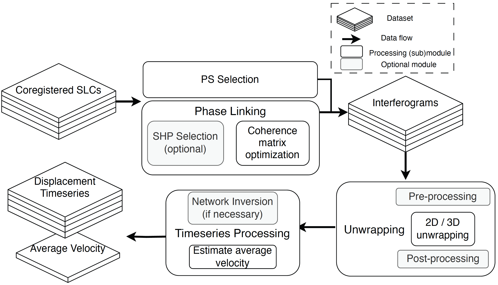

# Overview of Dolphin

Dolphin processes coregistered single-look complex (SLC) radar images into a time series of surface displacement. The software has an end-to-end surface displacement processing workflow, accessible through a command line tool, which calls core algorithms for PS/DS processing:

- The `shp` subpackage estimates the SAR backscatter distribution to find neighborhoods of statistically homogeneous pixels (SHPs) using the generalized likelihood ratio test from @Parizzi2011AdaptiveInSARStack or the Kolmogorov-Smirnov test from @Ferretti2011NewAlgorithmProcessing.
- The `phase_link` subpackage processes the complex SAR covariance matrix into a time series of wrapped phase using the CAESAR algorithm [@Fornaro2015CAESARApproachBased], the eigenvalue-based maximum likelihood estimator of interferometric phase (EMI) [@Ansari2018EfficientPhaseEstimation], or the combined phase linking (CPL) approach from @Mirzaee2023NonlinearPhaseLinking.
- The `ps` module selects persistent scatterer pixels from the full-resolution SLCs to be integrated into the wrapped interferograms [@Ferretti2001PermanentScattersSAR].
- The `unwrap` subpackage exposes multiple phase unwrapping algorithms, including the Statistical-cost, Network-flow Algorithm for Phase Unwrapping (SNAPHU) [@Chen2001TwodimensionalPhaseUnwrapping], the PHASS algorithm (available in the InSAR Scientific Computing Environment [@Rosen2018InSARScientificComputing]), and the Extended Minimum Cost Flow (EMCF) 3D phase unwrapping algorithm via the `spurt` library. Dolphin has pre- and post-processing options, including Goldstein filtering [@Goldstein1998RadarInterferogramFiltering] or interferogram masking and interpolation [@Chen2015PersistentScattererInterpolation].
- The `timeseries` module contains basic functionality to invert an overdetermined network of unwrapped interferograms into a time series and estimate the average surface velocity. The outputs of Dolphin are also compatible with the Miami INsar Time-series software for users who are already comfortable with MintPy [@Yunjun2019SmallBaselineInSAR].

To meet the computational demands of large-scale InSAR processing, Dolphin leverages Just-in-time (JIT) compilation, maintaining the readability of Python while matching the speed of compiled languages. The software's compute-intensive routines use the XLA compiler within JAX [@Bradbury2018JAXComposableTransformations] for efficient CPU or GPU processing. Users with compatible GPUs can see 5-20x speedups by simply installing additional packages. Dolphin manages memory efficiently through batch processing and multi-threaded I/O, allowing it to handle datasets larger than available memory while typically using a few gigabytes for most processing stages. These optimizations enable Dolphin to process hundreds of full-frame Sentinel-1 images with minimal configuration, making it well-suited for large-scale projects such as OPERA.

For more on running the `dolphin` command line tool, see the walkthroughs on the [Tutorials page](tutorials.md).
