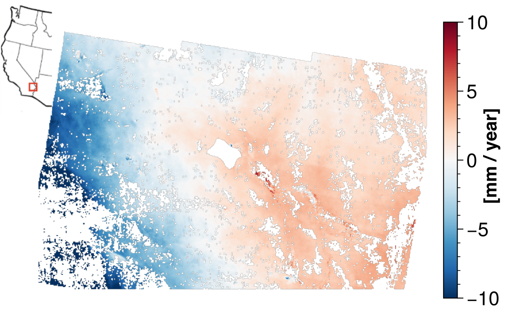

# Summary

<!-- A summary describing the high-level functionality and purpose of the software for a diverse, non-specialist audience. -->
Interferometric Synthetic Aperture Radar (InSAR) is a remote sensing technique used for measuring land surface deformation.
Conventional InSAR uses pairs of SAR images to get a single map of the relative displacement between the two acquisition times.
`dolphin` is a Python library which uses state-of-the-art multi-temporal algorithms to reduce the impact of noise sources and produce long time series of displacement at fine resolution.



# Statement of need
<!-- A Statement of need section that clearly illustrates the research purpose of the software and places it in the context of related work. -->

InSAR has been a powerful tool for decades, both in geophysical studies including tectonics, volcanism, and glacier dynamics, as well as human applications such as urban development, mining, and groundwater extraction. The launch of the European Space Agency's Sentinel-1 satellite in 2014 dramatically increased the availability of free, open-access SAR data. However, processing InSAR data has remained challenging, particularly for non-experts.

Advanced algorithms combining persistent scatterer (PS) and distributed scatterer (DS) techniques, also known as phase linking, have been developed over the past decade to help overcome decorrelation noise in longer time series [@Guarnieri2008ExploitationTargetStatistics]. Despite their potential, these methods have only recently begun to appear in open-source tools.

<!-- A list of key references, including to other software addressing related needs. -->
The phase linking first prototype was the [`FRInGE`](https://github.com/isce-framework/fringe) C++ library [@Fattahi2019FRInGEFullResolutionInSAR], which implements algorithms and workflows from @Ferretti2011NewAlgorithmProcessing and @Ansari2018EfficientPhaseEstimation. The [`Miaplpy`](https://github.com/insarlab/MiaplPy) Python library contains a superset of the features in `FRInGE`, as well as new algorithms developed in @Mirzaee2023NonlinearPhaseLinking. Additionally, the MATLAB [`TomoSAR`](https://github.com/DinhHoTongMinh/TomoSAR) library was made public in 2022, which implements the "Compressed SAR" (ComSAR) algorithm, a variant of phase linking detailed in @HoTongMinh2022CompressedSARInterferometry.

While these tools represent significant progress, there remained a need for software capable of handling the heavy computational demands of large-scale InSAR processing. `dolphin` was developed to meet this need, specifically for the Observational Products for End-Users from Remote Sensing Analysis (OPERA) project. OPERA, a Jet Propulsion Laboratory project funded by the Satellite Needs Working Group (SNWG), is tasked with generating a North American Surface Displacement product covering over 10 million square kilometers of land at 30 meter resolution or finer, with under 72 hours of latency.

# Overview of Dolphin

`dolphin` processes stacks of coregistered single-look complex (SLC) radar images into a time series of surface displacement. The software has pre-made workflows accessible through command line tools which call core algorithms for PS/DS processing:

- The `shp` subpackage estimates the SAR backscatter distribution to find neighborhoods of statistically homogeneous pixels (SHPs) using the generalized likelihood ratio test from @Parizzi2011AdaptiveInSARStack or the Kolmogorov-Smirnov test from @Ferretti2011NewAlgorithmProcessing.
- The `phase_link` subpackage processes the complex SAR covariance matrix into a time series of wrapped phase using the CAESAR algorithm [@Fornaro2015CAESARApproachBased], the eigenvalue-based maximum likelihood estimator of interferometric phase (EMI) [@Ansari2018EfficientPhaseEstimation], or the combined phase linking (CPL) approach from @Mirzaee2023NonlinearPhaseLinking.
- The `unwrap` subpackage exposes multiple phase unwrapping algorithms, including the Statistical-cost, Network-flow Algorithm for Phase Unwrapping (SNAPHU) [@Chen2001TwodimensionalPhaseUnwrapping] and the PHASS algorithm (available in the InSAR Scientific Computing Environment [@Rosen2018InSARScientificComputing]).
- The `timeseries` module contains basic functionality to invert an overdetermined network of unwrapped interferograms into a time series and estimate the average surface velocity. The outputs of `dolphin` are also compatible with the Miami INsar Time-series software for users who are already comfortable with MintPy [@Yunjun2019SmallBaselineInSAR].

To meet the computational demands of large-scale InSAR processing, `dolphin` leverages Just-in-time (JIT) compilation, maintaining the readability of Python while matching the speed of compiled languages. The software's compute-intensive routines use the XLA compiler within JAX [@Bradbury2018JAXComposableTransformations] for efficient CPU or GPU processing. Users with compatible GPUs can see 5-20x speedups by simply installing additional packages. `dolphin` manages memory efficiently through batch processing and multi-threaded I/O, allowing it to handle datasets larger than available memory while typically using a few gigabytes for most processing stages. These optimizations enable dolphin to process hundreds of full-frame Sentinel-1 images with minimal configuration, making it well-suited for large-scale projects such as OPERA.

The `dolphin` command line tool provides an interface for running the end-to-end displacement workflow. To illustrate, if a user has created a stack of coregistered SLCs in a `data/` directory, they only need to follow two steps to run the full workflow with all default parameters:

1. Configure the workflow with the `config` command, indicating the location of the SLCs, which dumps the output to a YAML file:

```python
dolphin config --slc-files data/*
```

2. Run the workflow saved in the YAML configuration file with the `run` command:

```python
dolphin run dolphin_config.yaml
```

\autoref{fig:mojave} shows an example result of the final average surface velocity map created by `dolphin`. The inputs were OPERA Coregistered Single-Look Complex (CSLC) geocoded images from Sentinel-1 data between February 2017 - December 2020 over the Mojave Desert.

# Acknowledgements

Copyright © 2024, California Institute of Technology ("Caltech"). U.S. Government sponsorship acknowledged.
The research was carried out at the Jet Propulsion Laboratory, California Institute of Technology, under a contract with the National Aeronautics and Space Administration (80NM0018D0004). OPERA, managed by the Jet Propulsion Laboratory and funded by the Satellite Needs Working Group, is creating remote sensing products to address Earth observation needs across U.S. civilian federal agencies.

# References
